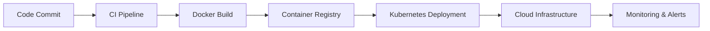
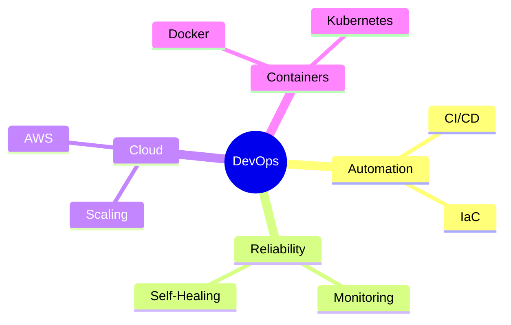

# 👋 Hi, I’m Emelin Abraham

  

  

🚀 **DevOps Engineer | Cloud & Automation Enthusiast**
🎓 First-year student | 🧑‍💻 DevOps Intern at **Nexoris Solutions** (Startup)

---

## 🧠 About Me

I work on **automating, deploying, and scaling systems** in cloud-native environments. My focus is on **reliability, repeatability, and clean automation** rather than application-heavy development.

This GitHub reflects **real DevOps work** — infrastructure, pipelines, containers, and cloud setups.

---

## 💼 Current Experience

### 🧑‍💻 DevOps / Cloud Intern — Nexoris Solutions

* Working in a **startup production environment**
* Contributing to **CI/CD automation and cloud deployments**
* Assisting with containerized workflows and system reliability
* Learning fast and shipping improvements

---

## 🛠️ Tech Stack

  

---

## 🧱 What I Do (DevOps Flow)

> From **commit to production**, fully automated.

---

## 🚀 Featured DevOps Projects

### 🔹 Cloud-Native CI/CD Pipeline

  

* Dockerized application
* Automated CI/CD with GitHub Actions
* Cloud deployment on AWS
* Zero manual release steps

---

### 🔹 Kubernetes Application Deployment

  

* Kubernetes Deployments & Services
* Auto-scaling & self-healing
* Production-style YAML configs

---

### 🔹 Infrastructure as Code (Terraform)

  

* AWS infrastructure via Terraform
* Repeatable, version-controlled infra
* Clean state management

---

## 📊 GitHub Activity & Commit Viewer

  

  

  

---

## 🧠 DevOps Mindset

> **Automate first. Debug deeply. Scale safely.**

---

## 🤝 What I Bring to a Team

* Strong ownership mindset
* Automation-focused problem solving
* Clear documentation & clean repos
* Comfortable with production systems

---

## 🔮 Growth Path

* DevOps Engineer → Senior DevOps / SRE
* Deeper cloud architecture & reliability work
* Platform & infrastructure ownership

---

## 📬 Let’s Connect

* 🌐 GitHub: This profile
* 🏢 Organization: Nexoris Solutions

---

🚧 **This profile evolves as I continue shipping real-world DevOps systems.**
