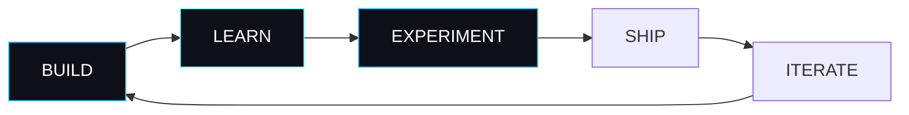

# 👋 Hey, I'm Emelin Abraham

  

  

  <b>FULL-STACK • AI/ML • CLOUD • DEVOPS • MOBILE</b>

  <i>Building software that solves real problems — from intelligent applications to the infrastructure behind them.</i>

---

## `> whoami`

🎓 Computer Science Student
💻 Full-Stack & AI/ML Developer
☁️ Cloud & DevOps Enthusiast
📱 Mobile Developer

I enjoy building **complete systems** rather than isolated applications — combining software, data, intelligence and infrastructure to turn ideas into working products.

```mermaid
flowchart LR
    A["FULL-STACK"] --> B["AI / ML"]
    B --> C["CLOUD"]
    C --> D["DEVOPS"]
    D --> E["MOBILE"]
    E --> F["SYSTEMS"]

    style A fill:#0D1117,stroke:#36BCF7,color:#FFFFFF
    style B fill:#0D1117,stroke:#7DF9FF,color:#FFFFFF
    style C fill:#0D1117,stroke:#36BCF7,color:#FFFFFF
    style D fill:#0D1117,stroke:#7DF9FF,color:#FFFFFF
    style E fill:#0D1117,stroke:#36BCF7,color:#FFFFFF
    style F fill:#7DF9FF,stroke:#36BCF7,color:#000000
```

---

# 🔥 Featured Projects

### 🧠 Karnataka Crime Intelligence Platform

An end-to-end intelligence platform combining **backend engineering, relational databases, graph technology and AI**.

Designed to transform structured crime data into useful investigative context.

`FastAPI` `PostgreSQL` `PostGIS` `Neo4j` `Python` `RAG` `AI`

 

---

### ⚙️ Mathematical Optimization Engine

A mathematical optimization system built around an **industrial refinery optimization problem**.

The system models operational variables, objectives and constraints to identify **feasible and optimized operating decisions**.

`Python` `Optimization` `Operations Research` `Mathematical Modelling`

 

---

### 🅿️ ParkSmart India

A location-focused parking platform designed to help users discover relevant parking within a defined area.

Built around a real-world problem involving **location services, data and intelligent processing**.

`PWA` `MongoDB` `Maps` `Computer Vision`

 

---

# 📊 GitHub Activity

  
  

  

  

---

# 🛠️ Technologies

  

---

# 💼 Experience

### DevOps / Cloud Intern — Nexoris Solutions

Previously worked as a DevOps / Cloud Intern at Nexoris Solutions, gaining hands-on experience in a startup engineering environment.

Worked across:

`CI/CD` · `Cloud Deployments` · `Docker` · `Automation` · `Deployment Workflows`

The experience gave me practical exposure to how software moves beyond development into deployment, infrastructure and production environments.

---

# 🧠 Currently Exploring

`AI Agents` · `RAG` · `Computer Vision` · `LLM Applications` · `Distributed Systems` · `Cloud Architecture`

```mermaid
flowchart LR
    A["BUILD"] --> B["LEARN"]
    B --> C["EXPERIMENT"]
    C --> D["SHIP"]
    D --> E["ITERATE"]
    E --> A

    style A fill:#0D1117,stroke:#36BCF7,color:#FFFFFF
    style B fill:#0D1117,stroke:#7DF9FF,color:#FFFFFF
    style C fill:#0D1117,stroke:#36BCF7,color:#FFF
```
